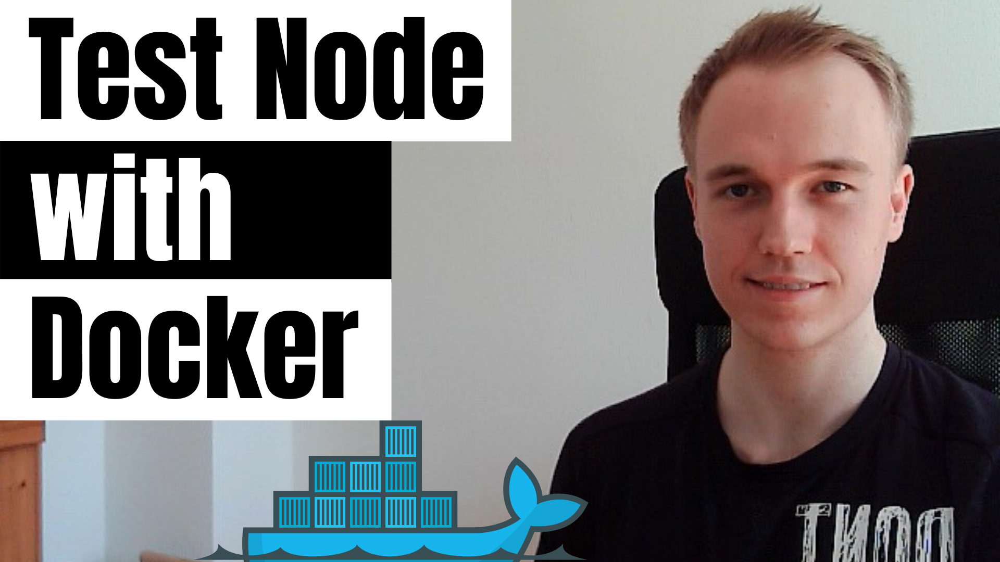

# Test a Node.js server with a database with Docker and docker-compose

This repository contains sample code on how to a Node.js app with Docker and docker-compose.

<h3 align="center">Please help this repo with a ⭐️ if you find it useful! 😁</h3>

This repository is part of the [Test Node with Docker](https://www.youtube.com/playlist?list=PL1Nml43UBm6eTkjJtAPfdfjk-x2I_1r-Y) tutorial series provided by [productioncoder.com](https://productioncoder.com/).

[](https://www.youtube.com/playlist?list=PL1Nml43UBm6eTkjJtAPfdfjk-x2I_1r-Y)

For updates, please reach out to [@productioncoder](https://twitter.com/productioncoder) on Twitter.

# 2. How to run this application

## 2.1. Running the project locally

You can run the project locally with your own local [Postgres](https://www.postgresql.org) instance

```
npm run dev
```

Make sure to update the configuration app with your database credentials in the `.config/local.json` file.

## 2.2. Running with docker compose

### 2.2.1 docker-compose up

Running:

```
docker-compose up
```

will spin up:

1. express server itself (internally port `8080`) forwarded to port `8080` on the host machine
2. Postgres database (internally `5432`), forwarded to port `2345`

We forward to port `2345` on purpose so it does not collide with a local [Postgres](https://www.postgresql.org) instance that might be running on the host machine.

To run in detached mode, use

```
docker-compose up -d
```

### 2.2.2 clean docker-compose run

If you would like to do a clean run (i.e. remove all data in already stopped containers), you can run

```
docker container prune
```

to remove all unused containers

As an alternative you can run

```
docker system prune
```

to clean up all unused resources. Note that this removes all the unused images, volumens etc. on your host machine.

### 2.2.3 docker-compose stop vs docker-compose down

Note that typing `ctrl` + `c` when running `docker-compose up` will only stop the container, but not remove it - which is equivalent of running:

```
docker-compose stop
```

I.e. if you start up the container again, the database will contain the data you have put in before.

Please refer to the above section on the clean docker-compose section on how to clean up all unused containers.

## 2.2. Running the webserver with docker but accessing db on host machine

If you want to to only run the webapp in a docker container, you need to adapt your configuration first.

Since the docker container itself is isolated, setting the database host to `localhost` would result in the container trying to connect to itself to connect to the database.

To connect to the database running on your host machine, you need to set the host name to `host.docker.internal`.

Change the `hostname` field under the `db` object inside the `./config.local.json` like so.

```
{
  "db": {
    "host": "host.docker.internal"
  }
}
```

You can leave the remaining config as it was.

This is a special DNS entry within the container that allows the container to connect to your host machine. Please refer to the [documentation](https://docs.docker.com/docker-for-mac/networking/#httphttps-proxy-support) for more details.

Once you have updated your config, you need to build an image and start a container from it.

Execute the following command from the root directory of the project (where the `Dockerfile` is located)

```
docker image build -t productioncoder/test-node-with-docker:local .
```

After that you can start a container

```
docker container run -p 8080:8080 productioncoder test-node-with-docker:local
```

The `-p` flag publishes the port from the docker container to your host machine.

# 3 Testing

## 3.1. Testing with docker-compose

Running

```
npm test
```

will spin up a [Postgres](https://www.postgresql.org) database (internally port `5432`), port-forwarded to port `2345` on the host machine.

It will then run all the tests with `mocha` as a test runner and then destroy the containers afterwards.

By testing with a real database, we achieve a high test-fidelity.

## 3.2 Running tests locally

You can run the tests with your local [Postgres](https://www.postgresql.org) database by running:

```
npm run test-local
```

Note that this add data to your local database and that the tests might fail if unique constraints are violated.
